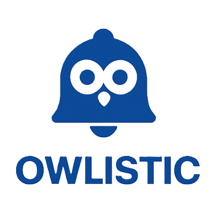
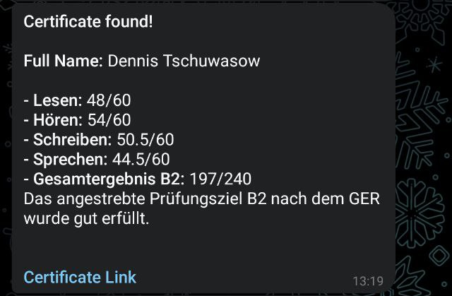

# Owlistic

[](https://github.com/dened/owlistic/actions) 
[](https://github.com/dened/owlistic/actions)
[](https://hub.docker.com/r/dchuvasov/owlistic)
[](https://opensource.org/licenses/MIT) 


**Owlistic** is a Telegram bot that helps users track their **Telc exam results**. Users simply enter their exam details, and the bot checks the official portal regularly. Once your certificate is available — you'll get a notification right in Telegram.

## ✨ Features

- **Automatic Certificate Tracking**: Periodically checks the Telc portal for exam results.
- **Telegram Notifications**: Notifies users when their certificates become available.
- **Easy Data Registration**: Add and manage your Telc exam details via simple bot commands.
- **Manual Check Option**: Trigger a check any time with `/check_now`.
- **Language Support**: Choose from English, German, or Russian.
- **User Consent Flow**: Ensures users approve data processing before storing any information.

## 📸 Screenshots



## 🚀 Getting Started

The application consists of two main executable components: the Telegram Bot and the Lookup Service.


### 🔧 Install Dependencies

1.  Ensure you have the Dart SDK installed.
2.  Clone this repository:
    ```sh
    git clone https://github.com/dened/owlistic.git
    cd owlistic
    ```
3.  Install dependencies and generate necessary files:
    ```sh
    dart pub get
    dart run build_runner build --delete-conflicting-outputs
    ```

### ▶️ Run the Application

**1. Telegram Bot (`bin/owlistic.dart`)**

This script runs the main Telegram bot that users interact with.

*   **Using command-line arguments:**
    ```sh
    dart run bin/owlistic.dart --token="YOUR_TELEGRAM_TOKEN" --privacy-policy-url="https://yourdomain.com/privacy" 
    ```

*   **Using a `.env` file:**
    Create a `.env` file in the project root (e.g., `owlistic/.env`):
    ```env
    token="YOUR_TELEGRAM_TOKEN"
    privacy-policy-url="https://yourdomain.com/privacy"
    ```
    Then, run the bot:
    ```sh
    dart run bin/owlistic.dart
    ```

**2. Certificate Lookup Service (`bin/lookup_service.dart`)**

This script is designed for periodic execution (e.g., by a cron job) to check for certificates for all registered users or for a specific user. It uses the same configuration mechanisms.

*   **To check for all users:**
    ```sh
    dart run bin/lookup_service.dart --token="YOUR_TELEGRAM_TOKEN" 
    ```

*   **To check for a specific user (replace `USER_CHAT_ID`):**
    ```sh
    dart run bin/lookup_service.dart --token="YOUR_TELEGRAM_TOKEN" --chat-id=USER_CHAT_ID --check-days=15
    ```
    The `.env` file will also be read by this script if present.

## ⚙️ Configuration

Configuration can be provided via command-line arguments or a `.env` file located in the project root. Command-line arguments take precedence over `.env` variables.
The application's `Arguments` class determines how environment variables are loaded. Typically, for an option like `--token`, the corresponding environment variable would be `TOKEN`. Please verify with the `Arguments` class implementation if a prefix (e.g., `CONFIG_`) is used.

| Argument                 | Environment Variable (`.env`) | Description                                                          | Default Value          | Used By         |
| :----------------------- | :-----------------------------| :------------------------------------------------------------------- | :--------------------- | :-------------- |
| `-t`, `--token`          | `CONFIG_TOKEN`                | **(Required)** Your Telegram bot API token.                          | —                      | Both            |
| `--privacy-policy-url`   | `CONFIG_PRIVACY-POLICY-URL`   | **(Required)** URL to your privacy policy document.                  | —                      | Both            |
| `-d`, `--db`             | `CONFIG_DB`                   | Path to the SQLite database file.                                    | `data/owlistic.db`     | Both            |
| `-v`, `--verbose`        | `CONFIG_VERBOSE`              | Logging verbosity. Options: `all`, `debug`, `info`, `warn`, `error`. | `info`                 | Both            |
| `-c`, `--chat-id`        |                               | (Integer) Specific chat ID to check.                                 | —                      | `lookup_service`|
| `--check-days`           |                               | (Integer) How many days to check from today and back.                | `10`                   | `lookup_service`|
| `--help`                 |                               | Show help message detailing all options and exit.                    |                        | Both            |

To see all available command-line options for each script, run:
```sh
dart run bin/owlistic.dart --help
dart run bin/lookup_service.dart --help
```

## 🛠️ Bot Commands

These are the main commands users can use:

| Command        | Description                              |
|----------------|------------------------------------------|
| `/start`       | Launches the bot and requests consent    |
| `/add`         | Add your exam details                    |
| `/show`        | View saved exam entries                  |
| `/delete`      | Remove saved entries                     |
| `/check_now`   | Manually trigger a result check          |
| `/language`    | Change the bot's language                |
| `/delete_me`   | Delete all your data from the bot        |
| `/help`        | Show help message and usage tips         |

## 🏗️ Building

### 🛠️ How to Compile
```sh
dart pub get
dart run build_runner build --delete-conflicting-outputs
dart compile exe bin/owlistic.dart -o owlistic.run
dart compile exe bin/lookup_service.dart -o lookup_service.run
```

### 🐋 How to Docker

```sh
docker build -t owlistic:latest .
docker compose up
```